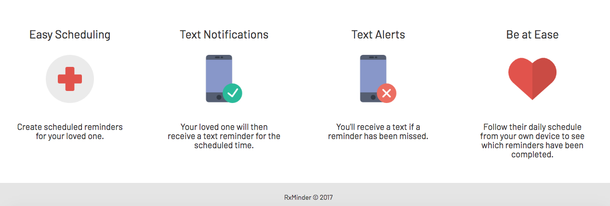
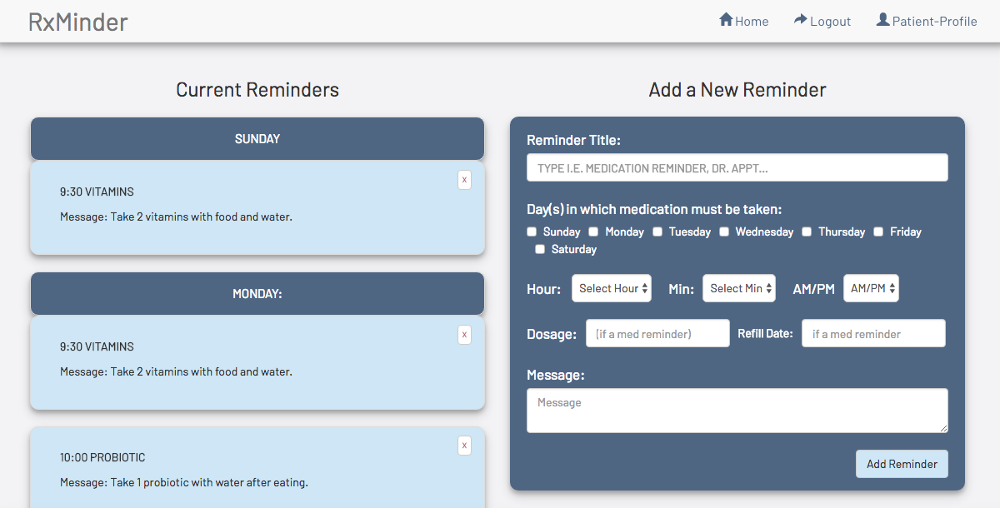
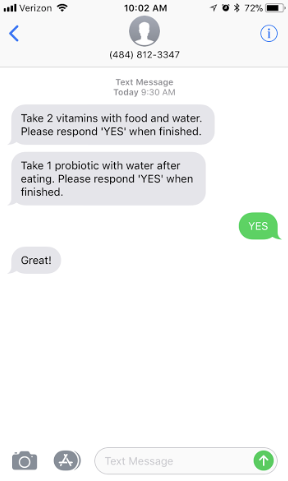
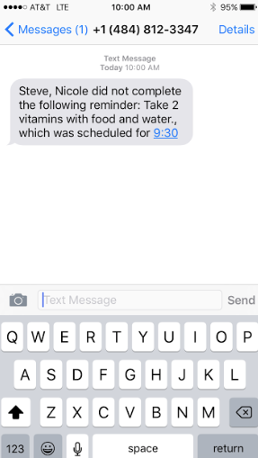

# RxMinder
A React-based Web Application

## Overview

RxMinder is designed to give you peace of mind while your loved one maintains their independence. Schedule medication reminders for others and be at ease knowing that they are following their regimen.

## Utilizing the App

* View the app: [Heroku Link](https://rxminder-app.herokuapp.com/)

* Sign up and create a profile for a loved one under your care.
* Schedule reminders, typically medication reminders, for the person you are caring for.
* They will receive text messages based on the scheduled reminders and will have to respond "YES" when they've completed their reminder. They are allotted 30 minutes to do so.
* If the patient doesn't respond to the text reminder within 30 minutes, you will receive a text that a reminder has been missed, along with details of the reminder.
* If the patient does respond within 30 minutes, you will not receive a text.
* You are able to view your online dashboard to see which reminders were completed and incompleted. Completed reminders are colored green and reminder that were missed are colored red. 

## Illustrating the App

### Home Page prior to signing up and logging in:

### Creating a Patient Profile and Setting up Reminders:

### When Patient Receives a Text Reminder:

### User Dashboard: When Patient Misses Reminder and Responds to Reminder:

### User Receives Text when Patient Misses Reminder:

## Tech used
- React.js
- React Bootstrap
- HTML/CSS
- JavaScript/JSX
- Express.js
- Node.js
- Moment.js
- MongoDB
- Twilio NPM Package
- Other NPM packages include: Bcrypt, Passport, Express-Session, Axios

## Built With

* Sublime Text - Text Editor

## Authors

* **Nicole Carvalho** - *Full-Stack Development* - [Nicole Carvalho](https://github.com/nicolelcarvalho)
* **Andrew Apicello** - *Full-Stack Development* - [Andrew Apicello](https://github.com/andrew-apicello)
* **Kaitlyn Folsom** - *Front-end development/Verification/Setting up passport* - [Kaitlyn Folsom](https://github.com/Jewel0106)
* **Analisa Leote** - *Front-end development/Setting up passport* - [Analisa Leote](https://github.com/aleote)

